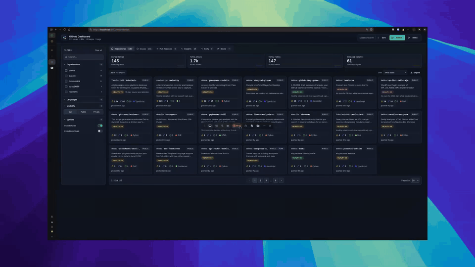

# Gitdeck

> The initial scaffolding of the upstream project was produced in an AI-assisted session with [Claude Code](https://claude.com/claude-code). This branch is a **ground-up Tauri/Rust rewrite** of that app — the feature set is kept, the Node backend is gone.

<p align="center">
  <a href="https://discord.gg/YrZPHAwMSG"></a>
</p>

<p align="center">
  <a href="https://repostars.dev/?repos=debba%2Fgh-dashboard&theme=dark"></a>
</p>

An open-source, local **desktop & mobile** dashboard to explore repositories, issues, pull requests, traffic, and CI activity across accounts on GitHub (and Forgejo-compatible forges — Codeberg, self-hosted — planned) from a single interface — plus a personal todo hub and an **MCP server** so an agent can manage your todos.

> Built on a **Tauri 2 + Rust** core with a **React 19** frontend. There is no Node sidecar, so the same app runs on Linux and **Android**. Attribution: feature set & UX inspired by [gitdeck](https://github.com/debba/gitdeck) by debba (MIT, see `LICENSE`); all GitHub access was reimplemented in Rust.

## Demo

<div align="center">
  
</div>

## What it does

The app pulls data from the GitHub REST and Search APIs and organizes it into a few different views:

- **Repositories** — card grid with description, language, stars, forks, open issues and last activity. Filter and sort across all your repos.
- **Issues / Pull Requests** — account-wide, cross-repo card grids with a shared filter/sort bar, useful for triage across many projects.
- **Triage** — a cross-repo workspace to act on issues directly: close/reopen, add/remove labels, assign to yourself, and comment.
- **Boards** — custom Kanban boards whose columns are **live smart-filters** (state / type / repo / label / text) that auto-fill, with manual drag-to-place as an override.
- **Inbox** — your GitHub notifications, with mark-read / mark-all-read.
- **CI Health** — the latest workflow run per repo (passing / failing / running) with a summary.
- **Insights** — overview of all repos with alerts ("issues need attention", "no push for X days") and a per-repo status (Strong / Watch / Risky).
- **Daily digest** — short per-repo summary of the day's movement (stars, open issues) computed from local daily snapshots, with an executive summary you can copy as Markdown.
- **Command palette** — `⌘K` / `Ctrl+K` to jump to any section, repo, issue or PR, or run a quick action.

### Per-repository view

Open any repository to see:

- **Overview** — stars, forks, open issues, owner, license, default branch, last push, topics, and a language breakdown bar.
- **Actions** — recent workflow runs.
- **Releases** — release history.
- **Forks** — list of forks.
- **Traffic** — views and clones for the last 14 days, unique visitors/cloners, top referrers, popular paths (requires push access; degrades gracefully otherwise).
- **Mentions** — references to the repo found via GitHub code/issue search.
- **Contributors** — list with commit counts.

### Issue & pull-request detail

Issues and PRs open **in-app** (not the browser): the Markdown body and comment timeline, assignees, labels and milestone, plus inline actions (close/reopen, label, assign, comment). For pull requests you also get the base ← head branches, diff stats, the **requested reviewers** (with a "review requested from you" badge) and each reviewer's decision with an overall review summary.

> Not (yet) ported from upstream: security/Dependabot alerts, repository dependents, stars/forks trend charts, and the OpenAI-generated digest narrative.

## Architecture

A Cargo workspace plus a Tauri desktop app — a single Rust core, a React frontend, no separate server process:

- **Core (Rust)** — the GitHub provider (`reqwest`, wiremock-tested), a `TaskService` + DTOs, OAuth (Authorization-Code + loopback), token storage via the OS keyring, and a SQLite store for todos, boards and snapshots. GitHub tokens **never reach the webview**.
- **Frontend** — a React 19 + Vite SPA that talks to the Rust core over Tauri commands (`invoke`) instead of HTTP. Data is cached client-side with TanStack Query (stale-while-revalidate, persisted across restarts).
- **MCP** — a stdio MCP server (`crates/mcp`) exposes the todo tools so an agent (e.g. Claude Code) can manage your list.

```
crates/core       pure domain + SQLite store (no reqwest/tauri)
crates/providers  GitHub provider (reqwest, wiremock tests)
crates/service    shared TaskService + DTOs
crates/auth       OAuth (Authorization-Code + loopback) + keyring token store
crates/mcp        stdio MCP server (rmcp)
apps/desktop      Tauri 2 shell (src-tauri, Rust commands) + React frontend (src)
```

### Tech stack

| Layer       | Tech                                                    |
| ----------- | ------------------------------------------------------- |
| Core        | Rust, Tauri 2, `sqlx` (SQLite), `reqwest`, `rmcp` (MCP) |
| Frontend    | React 19, Vite, react-router, Tailwind v4, TanStack Query |
| i18n        | react-i18next (English + German)                        |
| Tests       | `cargo test` + wiremock (Rust), Vitest (frontend)       |
| Package mgr | Cargo + Bun                                             |

### Translations

UI translations live in `apps/desktop/src/locales/` (`en.json`, `de.json`) — one dictionary per language. Add a language by copying `en.json` and wiring it into `apps/desktop/src/lib/i18n.ts`.

## Prerequisites

- **Rust** (stable) and **Bun**.
- Tauri 2 system dependencies — on Linux: `webkit2gtk-4.1`, `libsoup-3.0`, and the usual build tools (see the [Tauri prerequisites](https://tauri.app/start/prerequisites/)).
- A **GitHub OAuth App** (Authorization-Code flow — see next section).

## Configure GitHub

The app authenticates with a GitHub **OAuth App** using the **Authorization-Code flow** with a loopback redirect. You do this once.

### 1. Create the OAuth App

1. Go to <https://github.com/settings/developers> → **OAuth Apps** → **New OAuth App**.
2. Fill in the form:
   - **Application name** — anything, e.g. `Gitdeck (local)`.
   - **Homepage URL** — `http://127.0.0.1:8788` (informational).
   - **Authorization callback URL** — set this **exactly** to `http://127.0.0.1:8788/callback`. The app listens on this fixed loopback port during sign-in.
3. Click **Register application**.

### 2. Copy the Client ID and generate a Client Secret

Copy the **Client ID** and click **Generate a new client secret**. Unlike a device-flow app, the Authorization-Code flow uses a secret — the app exchanges the code for a token locally and stores it in your OS keyring.

### 3. Sign in from the UI

Open the app → **Settings** → **Connect a GitHub account**, paste the **Client ID** and **Client Secret**, and click connect. Your browser opens for approval; the app captures the loopback callback, exchanges the code, and stores the token in the keyring — **the token never reaches the webview**. The account is named after your GitHub login. Requested scope: `repo`.

To revoke access later, remove the app from <https://github.com/settings/applications> and delete the account in Settings.

## Install

```bash
# Rust workspace deps are fetched by cargo on first build.
cd apps/desktop && bun install
```

## Run in development

```bash
cd apps/desktop && bun run tauri dev
```

This builds the Rust core and launches the desktop window with the Vite dev server hot-reloading the frontend. On Linux/Wayland the app sets `WEBKIT_DISABLE_DMABUF_RENDERER=1` automatically to avoid a WebKitGTK rendering crash.

## Build

```bash
cd apps/desktop && bun run tauri build
```

Produces a native bundle for the host platform. Android builds use `bun run tauri android` (see the [Tauri mobile guide](https://tauri.app/develop/#mobile)).

## Test & type-check

```bash
cargo test --workspace          # Rust core + providers (wiremock)
cd apps/desktop && bun run test  # frontend (Vitest)
cd apps/desktop && bun run build # type-check + production bundle
```

Provider logic is covered by wiremock tests; pure frontend logic (filters, board resolution, insights, review summaries) has its own Vitest suites.

## Project layout

```
.
├── Cargo.toml                 # workspace manifest
├── crates/
│   ├── core/                  # domain + SQLite store (+ migrations/)
│   ├── providers/             # GitHub provider (reqwest, wiremock)
│   ├── service/               # TaskService + DTOs
│   ├── auth/                  # OAuth + keyring token store
│   └── mcp/                   # stdio MCP server (rmcp)
├── apps/desktop/
│   ├── src-tauri/             # Tauri shell + #[tauri::command]s (Rust)
│   │   └── src/lib.rs         # command surface / invoke handler
│   ├── src/                   # React 19 SPA
│   │   ├── App.tsx            # routing
│   │   ├── components/        # Shell, dashboard, boards, command palette, ui
│   │   ├── pages/             # views (repos, issues, boards, triage, detail, …)
│   │   ├── lib/               # api client, query hooks, pure logic
│   │   └── locales/           # en.json / de.json
│   └── NOTICE                 # gitdeck attribution
└── docs/                      # design specs & implementation plans
```

## Status

A ground-up rewrite in progress — most of the gitdeck feature set is in place on the new Tauri/Rust core; multi-provider (Forgejo/Codeberg, ClickUp) is next. Expect rapid changes.

## Community

- [Discord server](https://discord.gg/YrZPHAwMSG) — suggest features, report issues, or just say hi.

## Contributing

Before opening a PR, run the gates — `cargo test --workspace` and, in `apps/desktop`, `bun run test` + `bun run build`. Conventions: English-only identifiers, keep pure logic in `crates/core` and `apps/desktop/src/lib` with mirrored tests, and never expose GitHub tokens to the webview.

## License

MIT License — see [LICENSE](LICENSE). Inspired by and attributed to [gitdeck](https://github.com/debba/gitdeck) (debba).
